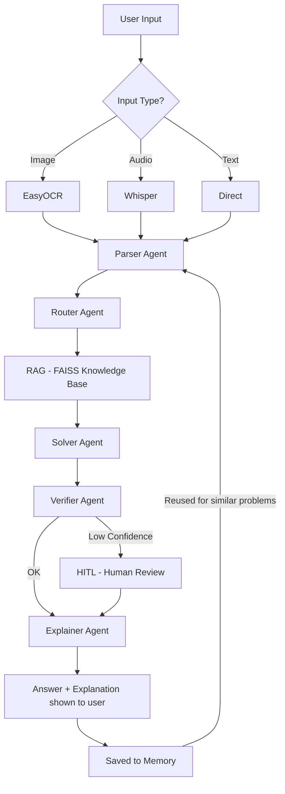

# Math Mentor

A multimodal math solving app built for the AI Planet AI Engineer Assignment. It can take a math problem from an image, audio, or plain text and solve it step by step.

---

## What it does

- Accepts a math problem as typed text, an uploaded image, or an audio file
- Extracts text from images using EasyOCR and from audio using Whisper
- Runs the problem through a pipeline of 5 agents that parse, route, solve, verify, and explain the solution
- Uses a small knowledge base of math formulas (RAG with FAISS) to help the solver
- Asks for human review if OCR quality is low or the verifier is not confident (HITL)
- Saves every solved problem to memory and reuses similar past solutions

---

## Setup

Make sure you have Python 3.10 and a free Groq API key from https://console.groq.com

```bash
conda create -n mathmentor python=3.10 -y
conda activate mathmentor

pip install streamlit python-dotenv groq
pip install langchain langchain-community langchain-text-splitters
pip install faiss-cpu sentence-transformers
pip install easyocr Pillow numpy
pip install torch --index-url https://download.pytorch.org/whl/cpu
pip install openai-whisper
```

Copy the example env file and add your key:
```bash
cp .env.example .env
```

Inside `.env`:
```
llm_api_key=your_groq_key_here
```

Run the app:
```bash
streamlit run app.py
```

---

## Architecture



---

## Agents

1. **Parser Agent** — cleans the raw input and extracts topic, variables, and constraints into a structured format
2. **Router Agent** — decides the problem type and the best approach to solve it
3. **Solver Agent** — solves the problem using retrieved formulas from the knowledge base
4. **Verifier Agent** — checks the solution for correctness and triggers human review if not confident
5. **Explainer Agent** — writes a simple step-by-step explanation for the student

---

## Project structure

```
math-mentor/
├── app.py
├── agents.py
├── rag_pipeline.py
├── memory.py
├── ocr_handler.py
├── audio_handler.py
├── knowledge_base/
│   ├── algebra.txt
│   ├── probability.txt
│   ├── calculus.txt
│   ├── linear_algebra.txt
│   └── solution_templates.txt
├── data/
│   └── memory.json
├── requirements.txt
├── .env.example
└── README.md
```

---

## Deployment

Deployed on Streamlit Cloud. To deploy your own:
1. Push the code to GitHub (don't commit `.env`)
2. Go to share.streamlit.io and connect the repo
3. Add `llm_api_key` in the Secrets section
4. Deploy

Live link: your-link-here
Demo video: your-video-link-here
